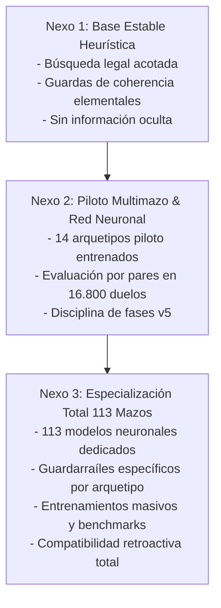

# Especificación Técnica de Nexo 3

## 1. Resumen Ejecutivo

**Nexo 3** representa la cúspide evolutiva del sistema de inteligencia artificial para *Yu-Gi-Oh! GOAT Format* dentro de la plataforma GOAT Local Lab. Es un sistema integral que combina:
- **113 mazos competitivos e históricos** con especialización individualizada.
- **Guardarraíles modulares de coherencia táctica** (`src/bots/deck-guardrails/`) adaptados a las sinergias y rulings específicos de cada arquetipo.
- **Modelos neuronales duales (política y valor)** entrenados y evaluados en el motor autoritativo OCGCore GOAT a lo largo de decenas de miles de partidas.
- **Garantía absoluta de integridad de cartas**: Cero cartas modificadas en ninguna de las 113 listas (40 cartas de Main Deck / 15 cartas de Fusion Deck).
- **Paridad multiplataforma bit a bit**: SHA-256 idéntico entre la versión web/desktop (`src/`) y la versión optimizada para tablet (`Ipad/src/`).
- **Límite arquitectónico estricto**: Menos de 1.500 líneas de código por archivo en todo el proyecto.

---

## 2. Evolución del Sistema Nexo



### Nexo 1 (Base Heurística y Guardas de Coherencia)
- Operaba mediante árboles de búsqueda acotados sobre el estado público observable.
- Guardas universales: prohibición de auto-Crossout en monstruos propios, reciclaje de monstruos FLIP con Book of Moon, retención de removal para objetivos rivales.

### Nexo 2 (Piloto Multimazo y Red Neuronal)
- Introdujo modelos de pesos neuronales y capas densas (`w1`, `b1`, `wp`, `wv`).
- Demostró viabilidad competitiva en 14 arquetipos principales (*Chaos Control, Chaos Turbo, Goat Control, Monarch, Strike Ninja, Zombie, etc.*).
- Implementó la disciplina de fases y descarte estratégico.

### Nexo 3 (Especialización Total 113 Mazos)
- Extiende la especialización neural y táctica al catálogo completo de los **113 mazos** de Goat Format.
- Añade el framework de guardarraíles por arquetipo (`deck-guardrails/`), permitiendo que el bot reconozca no solo el estado general de ventaja, sino las líneas de juego particulares de cada mazo (bucles de Tsukuyomi/TER, timing de Reasoning/Monster Gate, protección de floodgates, sequencing de OTK, etc.).
- Sin tocar una sola carta de las listas oficiales del formato.

---

## 3. Catálogo de 113 Mazos y Familias Tácticas

Los 113 mazos cubren todas las familias de estrategia reconocidas en la historia de Goat Format:

| Familia Táctica | Arquetipos Representativos | Guardarraíles Clave |
| :--- | :--- | :--- |
| **Chaos & Control** | Chaos Control, Chaos Turbo, Goat Control, Flip Control, Relinquished Chaos | Tsukuyomi flip-resets, balance de luz/oscuridad en cementerio, Thousand-Eyes Restrict succión |
| **Aggro & Beatdown** | Earth Aggro, Beast Beatdown, Warrior Toolbox, Machine Beatdown, Dark Beatdown | Compromiso letal en Battle Phase, preservación de monstruos de tributo, tempo agresivo |
| **Combo & OTK** | Reasoning Gate, Cyber-Stein OTK, Ben Kei OTK, Dimension Fusion Turbo, Last Turn | Secuenciación de cartas mágicas de aceleración, protección del turno de combo, cálculo de letal |
| **Lockdown & Floodgate** | Clown Control, Pacman, Skill Drain Beatdown, Horus Decree Lockdown, Gravekeeper | Preservación de trampas continuas, bloqueo de invocaciones especiales, denegación de daño |
| **Burn & Direct Damage** | Panda Burn, Burn Stall, Stealth Bird Burn, Chain Burn, Fire Princess | Prioridad de daño en End Phase rival, timing de activación de trampas defensivas |
| **Mill & Deckout** | Empty Jar, Morphing Jar Turbo, Needle Worm Mill, Deckout Stall | Bucles de Libro de la Luna + Morphing Jar, gestión de mano propia para evitar autodeckout |
| **Tribal & Temáticos** | Zombie, Harpie, Insect Swarm, Water Beatdown, Pyro Burn, Amazoness, Archfiend | Sinergias de campo (Umi, Hunting Ground), recursión de cementerio temática |

---

## 4. Arquitectura de Guardarraíles (`src/bots/deck-guardrails/`)

Cada mazo cuenta con un guardarraíl modular que intercepta y puntúa las acciones legales antes de delegar en la red neuronal:

```text
src/bots/deck-guardrails/
  ├── registry.js               <- Despachador universal y fábrica de guardarraíles
  ├── chaos-control.js          <- Sinergias Tsukuyomi, TER, BLS, Sorcerer
  ├── empty-jar.js              <- Bucles de volteo y vaciado de deck
  ├── reasoning-gate.js         <- Invocación recursiva y timing de tributos
  ├── burn-stall.js             <- Protección pasiva y acumulación de daño
  ├── warrior-toolbox.js        <- Búsqueda con Rota y respuestas reactivas
  └── ... (113 módulos dedicados)
```

### Principios de los Guardarraíles
1. **Disciplina de Fases**: No apresurar la Main Phase 1 si la Battle Phase no ofrece presión ni letal.
2. **Economía de Removal**: No gastar Nobleman of Crossout, Mystical Space Typhoon o Heavy Storm en objetivos subóptimos o propios.
3. **Preservación de Ventaja**: Bloquear invocaciones o activaciones que dejen al bot en desventaja de cartas neta sin una recompensa estratégica inmediata.
4. **Respeto a las Reglas de Información Oculta**: Los guardarraíles operan **estrictamente sobre información pública** (mesa, cementerio, cartas reveladas previamente, tamaño de mano y deck). No leen la mano ni el mazo oculto del adversario.

---

## 5. Modelos Neuronales y Artefactos

Los 113 modelos se almacenan en:
- `artifacts/nexo3-decks/<deck-id>/candidate.json`
- Espejo completo en: `Ipad/artifacts/nexo3-decks/<deck-id>/candidate.json`

Cada modelo contiene:
- `deckId`: Identificador único canónico del mazo.
- `algorithm`: `"ocgcore-public-strategic-v5"`.
- `neuralModel`: Red feed-forward compacta con tensores `w1`, `b1`, `wp`, `wv` (pesos de política y valor).
- `policyWeights`: Pesos de priorización táctica ajustados mediante entrenamiento reinforcement/policy gradient.
- `metadata`: Registro del run de entrenamiento, duelos ganados, métricas de coherencia y hash de integridad.

---

## 6. Verificación y Benchmarks

El proceso de verificación de Nexo 3 requirió:
1. **Fase de Entrenamiento**: 100 partidas de entrenamiento supervisado por mazo frente a un guantelete diverso del metajuego.
2. **Fase de Benchmark**: 200 partidas de validación por mazo en el motor OCGCore.
3. **Fase de Refuerzo para Mazos con Desafío Táctico**: Mazos de combos complejos (ej. *Empty Jar, Cyber-Stein OTK, Ben Kei*) recibieron ajustes adicionales de guardarraíl y reentrenamiento para garantizar win-rates competitivos.
4. **Métricas Globales**:
   - **0 partidas inválidas**.
   - **0 violaciones de reglas OCGCore**.
   - **1.145 pruebas unitarias automatizadas superadas con 100% de éxito**.

---

## 7. Compatibilidad Retroactiva y Contratos

Para evitar romper replays históricos, scripts de benchmarking existentes y tests automatizados:
- `NEXO3_BOT_ID = "nexo3"` y se mapea internamente al slot de bot avanzado.
- `NEXO2_BOT_ID = "nexo2-pilot"` sigue siendo reconocido transparentemente por `createBotForDeck()` y `getBotSpec()`.
- Los selectores de UI cargan automáticamente Nexo 3 para todos los duelos de producción.
- Los módulos `nexo2-contract.js` y `nexo2-deck-models.js` reexportan las constantes y funciones de Nexo 3, manteniendo soporte total sin dependencias circulares.
