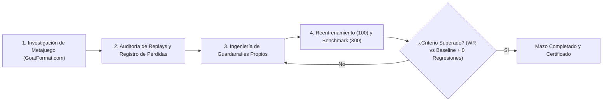
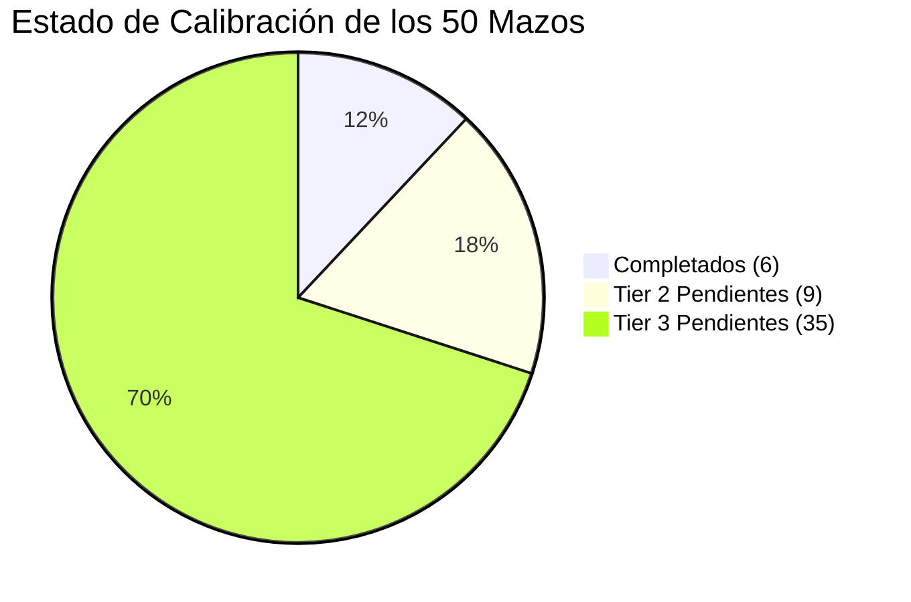

# Protocolo de Especialización Táctica y Plan Maestro de los 50 Mazos (Nexo 2)

Este documento establece el **estándar oficial de ingeniería táctica** para la optimización, entrenamiento y validación de las 50 barajas de Yu-Gi-Oh! Goat Format en la arquitectura **Nexo 2**, así como la hoja de ruta sistemática en **lotes de 3 mazos** hasta cubrir la totalidad del metajuego.

---

## PARTE I: EL PROTOCOLO DE MEJORA EN 4 FASES

Cada mazo del sistema debe atravesar estrictamente las siguientes 4 fases para ser considerado oficialmente calibrado y completado:

### Fase 1: Investigación de Metajuego y Verificación Canónica
1. **Fuentes Oficiales**: Consulta de guías históricas, artículos de arquetipo y listas de torneo de **GoatFormat.com** (SJC 2005, FLC, Regionales clásicos).
2. **Auditoría de Lista de Cartas**:
   - Comprobar que la baraja contiene exactamente 40 cartas en el Main Deck y 15 en el Fusion Deck.
   - Detectar y erradicar cartas de relleno por defecto (e.g. *Axe Raider*). Si faltan cartas para llegar a 40, restaurar las piezas canónicas omitidas (e.g. *Vampire Lord* en Zombie).
   - Prohibido inventar cartas o alterar el Card Pool histórico de 2005.
3. **Calibración de Perfil Táctico** en `src/decks/deck-profiles.js`:
   - Clasificación en su Tier correspondiente (Tier 1, Tier 2, Tier 3).
   - Asignación de estilo (`control`, `midrange`, `aggro`, `combo`, `stall`).
   - Tolerancia al riesgo (`riskTolerance`): 0.25 para control incremental, 0.40 para midrange, 0.50 para aggro, y hasta 0.70 para combos que no toleran pasividad.

### Fase 2: Auditoría de Replays y Análisis de Patologías Tácticas
1. **Extracción de Derrotas**: Inspección de partidas perdidas del macroentrenamiento previo (dataset de 10.000 partidas) y de los benchmarks cruzados.
2. **Detección de Decisiones Suicidas**:
   - Auto-destrucción por efectos obligatorios (*Zaborg* destruyéndose a sí mismo ante mesa rival vacía).
   - Destrucción de recursos propios (*Mobius* o *Heavy Storm* destruyendo retaguardia propia innecesariamente).
   - Invocación de atacantes/flotadores débiles en Modo de Ataque en lugar de Set (*Apprentice Magician*, *Pyramid Turtle*, *Giant Rat*, *Magical Merchant*).
   - Desperdicio de combustible en cementerio (*Chaos Sorcerer* o *BLS* desterrando a *Magician of Faith* teniendo reanimadores en mano).
   - Autolesión de LP sin letal (*Brain Control* o *Cyber-Stein* pagando LP cuando el turno no cerrará la partida).
   - Incompatibilidad de permanentes (activar *Call of the Haunted* bajo *Royal Decree* o *Skill Drain*).

### Fase 3: Ingeniería de Guardarraíles Propios y Modulares
1. **Encapsulamiento Estricto**:
   - Cada mazo tiene su archivo exclusivo: `src/bots/deck-guardrails/<deckId>.guardrails.js`.
   - **Prohibido contaminar el guardarraíl general** (`decision-guardrails.js`) con reglas particulares de un solo mazo.
2. **Registro en el Enrutador**:
   - Importar y registrar en el mapa de `src/bots/deck-guardrails/index.js` tanto con su ID canónico como con alias con y sin prefijo `goatformat-`.
3. **Reglas de Oro de Arquitectura y Calidad**:
   - **Límite de Tamaño**: Ningún archivo de código de la solución puede superar las **1.500 líneas**.
   - **Paridad SHA-256 Bit a Bit**: Cada cambio o nuevo archivo en `src/` debe replicarse de forma idéntica en `Ipad/src/`.
   - **Cero Regresiones**: La suite de pruebas (`npm test` / `node --test`) con más de 1.145 tests debe mantenerse al **100% aprobada (0 fallos)**.

### Fase 4: Reentrenamiento y Benchmark de Validación
1. **Reentrenamiento Focalizado (100 Partidas por Mazo)**:
   - Simulación nativa OCGCore en C++ (`src/tools/nexo-deck-trainer.mjs`) con 4 hilos concurrentes.
   - El modelo neuronal y la política aprenden a operar bajo los nuevos límites del guardarraíl, actualizando pesos en `artifacts/nexo2-decks/<deckId>/candidate.json` (y réplica en `Ipad/`).
2. **Benchmark Competitivo Riguroso (300 Partidas por Mazo — 900 por Lote)**:
   - Evaluación estructurada contra los 10 arquetipos más representativos del metajuego:
     - 10 emparejamientos × 30 partidas c/u (15 vs NEXO 1 Universal + 15 vs NEXO 2 Calibrado).
     - Alternancia matemática de inicio (50% empezando primero, 50% segundo).
3. **Métricas de Éxito**:
   - Incremento verificable del Win Rate respecto a la línea base previa.
   - Generación de informes JSON individuales en `artifacts/<deck>-300-retrained-benchmark-report.json` y consolidado del lote.
   - Actualización del registro histórico en `walkthrough.md`.

---

## PARTE II: PLAN MAESTRO DE LOS 50 MAZOS EN LOTES DE 3

### Estado Global de Cobertura
* **Completados y Certificados**: **6 mazos** (12.0%)
* **Pendientes de Ejecución**: **44 mazos** (88.0%)
* **Total de Lotes**: **16 lotes** (Lotes 0 y 1 finalizados; Lotes 2 al 16 planificados).

---

### Catálogo Maestro y Cronograma de Lotes

| Lote | ID Mazo | Nombre del Mazo | Tier Oficial | WR Previo (200) | Enfoque Táctico y Guardarraíles Clave | Estado |
|:---:|---|---|:---:|:---:|---|:---:|
| **Lote 0** | `warrior` | Warrior / Anti-Meta | Tier 2 | 37.7% $
ightarrow$ **46.7%** | Toolbox Sean Montague (10 guerreros), ROTA reactivo, Blade Knight set. | **COMPLETADO** |
| | `goat-control` | Goat Control | Tier 1 | 44.3% $
ightarrow$ **49.0%** | Loop TER-Tsukuyomi, Scapegoat timing, protección contra Burn. | **COMPLETADO** |
| | `chaos-turbo` | Chaos Turbo | Tier 1 | 55.0% $
ightarrow$ **56.0%** | Thunder Dragon thinning, Raigeki Break discard, Chaos Sorcerer. | **COMPLETADO** |
| **Lote 1** | `chaos-control` | Chaos Control | Tier 2 | 41.5% $
ightarrow$ **46.3%** | Loop TER, banish prioritario de Chaos Sorcerer, Skilled White beatdown. | **COMPLETADO** |
| | `goatformat-monarch` | Monarch (Soul Control) | Tier 2 | 43.0% $
ightarrow$ **46.7%** | Anti-suicidio de Zaborg, tributo de monstruos robados (Brain Control). | **COMPLETADO** |
| | `goatformat-zombie` | Zombie | Tier 2 | 54.5% $
ightarrow$ **57.7%** | Vampire Lord canónico, Pyramid Turtle set, Creature Swap, Book of Life. | **COMPLETADO** |
| **Lote 2** | `goatformat-drain-aggro` | Drain Aggro | Tier 2 | 63.0% | Gestión de Skill Drain, no activar contra mesa sin efectos, 1900 beatdown. | *Siguiente* |
| | `earth-aggro` | Earth Aggro | Tier 2 | 59.0% | Gestión de Gigantes (no destruir backrow propia), preservar mano para Muka. | *Siguiente* |
| | `goatformat-beatdown` | Beatdown | Tier 2 | 58.0% | Ataque seguro contra backrow seteada, gestión de 1900 beater sin arriesgar. | *Siguiente* |
| **Lote 3** | `chaos-recruiter` | Chaos Recruiter | Tier 2 | 56.5% | Timing de Creature Swap con Tomato/Angel, preparación exacta LUZ/OSC. | *Planificado* |
| | `goatformat-chaos-return` | Chaos Return | Tier 2 | 49.0% | Activación de Return from the Different Dimension con $ge 3$ monstruos y letal. | *Planificado* |
| | `goatformat-strike-ninja` | Strike Ninja | Tier 2 | 48.5% | Evasión de Strike Ninja con D.D. Scout Plane, gestión de coste en cementerio. | *Planificado* |
| **Lote 4** | `goatformat-gravekeeper` | Gravekeeper | Tier 2 | 42.0% | Mantenimiento de Necrovalley, volteo seguro de Spy y Guard, control Assailant. | *Planificado* |
| | `goatformat-bazoo-return` | Bazoo Return | Tier 2 | 36.0% | Preservación de cementerio para Bazoo, timing de Return. | *Planificado* |
| | `flip-control` | Flip Control | Tier 2 | 29.0% | Ciclo Tsukuyomi con Magician of Faith y Gravekeeper's Spy. | *Planificado* |
| **Lote 5** | `goatformat-lockdown-burn` | Lockdown Burn | Tier 3 | 70.5% | Protección de Gravity Bind / Level Limit, timing de Wave-Motion Cannon. | *Planificado* |
| | `goatformat-burn` | Classic Burn | Tier 3 | 65.5% | Maximización de daño indirecto (Just Desserts, Secret Barrel, Ojama Trio). | *Planificado* |
| | `panda-burn` | Panda Burn | Tier 3 | 57.5% | Ojama Trio + Gyaku-Gire Panda combo, daño por penetración. | *Planificado* |
| **Lote 6** | `reasoning-gate` | Reasoning Gate | Tier 3 | 50.0% | Activación de Monster Gate / Reasoning, loop de DMoC con magias de robo. | *Planificado* |
| | `goatformat-last-warrior` | Last Warrior | Tier 3 | 53.0% | Fusión segura de The Last Warrior from Another Planet sin anular campo propio. | *Planificado* |
| | `goatformat-flute-dragon` | Flute Dragon | Tier 3 | 51.0% | Flute of Summoning Dragon + Lord of D. para doble Dragón de gran calibre. | *Planificado* |
| **Lote 7** | `goatformat-harpie` | Harpie | Tier 3 | 50.5% | Hunting Ground destrucción selectiva de magia enemiga, swarm con Hysteric Party. | *Planificado* |
| | `goatformat-horus` | Horus | Tier 3 | 47.0% | Subida de nivel Horus LV4 $
ightarrow$ LV6 $
ightarrow$ LV8, bloqueo de magias enemigas. | *Planificado* |
| | `goatformat-armed-dragon` | Armed Dragon | Tier 3 | 43.0% | Gestión de descarte de monstruos para efecto de destrucción de Armed Dragon. | *Planificado* |
| **Lote 8** | `goatformat-insect` | Insect Aggro | Tier 3 | 47.0% | Swarm con Pinch Hopper y Ultimate Insect, Insect Barrier. | *Planificado* |
| | `goatformat-elemental-hero`| Elemental HERO | Tier 3 | 46.5% | Fusión de Flame Wingman / Thunder Giant con Polymerization y Miracle Fusion. | *Planificado* |
| | `goatformat-buster-blader` | Buster Blader | Tier 3 | 46.0% | Búsqueda de Emblem of Dragon Destroyer y sinergia anti-dragón. | *Planificado* |
| **Lote 9** | `goatformat-blue-eyes-white-dragon` | Blue-Eyes Dragon | Tier 3 | 43.5% | Kaibaman, Paladin of White Dragon, invocación de 3000 ATK. | *Planificado* |
| | `goatformat-creator` | The Creator | Tier 3 | 41.0% | Coste de descarte óptimo para The Creator, reanimación de monstruos clave. | *Planificado* |
| | `goatformat-dark-magician`| Dark Magician | Tier 3 | 39.0% | Skilled Dark Magician, Dark Magic Attack para barrer backrow. | *Planificado* |
| **Lote 10** | `goatformat-guardian-control` | Guardian Control | Tier 3 | 46.5% | Requisito de armas equipadas para Guardian Ceal / Grarl / Baou. | *Planificado* |
| | `goatformat-archfiend` | Archfiend | Tier 3 | 44.0% | Gestión de coste de LP en Standby Phase con Pandemonium activo. | *Planificado* |
| | `goatformat-spell-counter-control` | Spell Counter | Tier 3 | 42.0% | Acumulación de contadores mágicos en Defender y Breaker, Pitch-Black. | *Planificado* |
| **Lote 11** | `goatformat-machine-otk` | Machine OTK | Tier 3 | 43.0% | Limiter Removal en Damage Step para letal exacto sin autodestrucción prematura. | *Planificado* |
| | `goatformat-aggro-bomb` | Aggro Bomb | Tier 3 | 41.0% | Timing de daño de efecto agresivo y limpia de mesa combinada. | *Planificado* |
| | `goatformat-cyber-stein-otk` | Cyber-Stein OTK | Tier 3 | 28.5% | Pago de 5000 LP condicionado a Trunade/Heavy Storm o anulación de trampas. | *Planificado* |
| **Lote 12** | `goatformat-amazon` | Amazoness | Tier 3 | 42.5% | Amazoness Swords Woman (reflejo de daño), Amazoness Archers. | *Planificado* |
| | `goatformat-rescue-cat` | Rescue Cat | Tier 3 | 42.0% | Activación de Rescue Cat buscando Milus Radiant / Gyaku-Gire Panda. | *Planificado* |
| | `goatformat-banish-turbo` | Banish Turbo | Tier 3 | 40.5% | Banisher of the Light, Gren Maju Da Eiza y Soul Release. | *Planificado* |
| **Lote 13** | `goatformat-deckout` | Deckout (Mill) | Tier 3 | 44.0% | Aceleración de Morphing Jar, Needle Worm y Card Destruction para vaciar deck. | *Planificado* |
| | `goatformat-wall-stall` | Wall Stall | Tier 3 | 42.0% | Muro defensivo infranqueable (Spirit Reaper, Marshmallon tech, Big Shield). | *Planificado* |
| | `goatformat-final-countdown` | Final Countdown | Tier 3 | 41.5% | Contabilización de 20 turnos con máxima retención defensiva (Threatening Roar).| *Planificado* |
| **Lote 14** | `goatformat-cat-control` | Cat Control | Tier 3 | 35.5% | Des Lacooda y Stealth Bird con protección pasiva. | *Planificado* |
| | `goatformat-relinquished-control` | Relinquished | Tier 3 | 35.0% | Invocación ritual con Black Illusion Ritual, absorción continua de amenazas. | *Planificado* |
| | `goatformat-spatial-collapse` | Spatial Collapse | Tier 3 | 34.5% | Cerrar el cerrojo de 5 cartas en mesa SOLO cuando el bot posee ventaja numérica.| *Planificado* |
| **Lote 15** | `goatformat-direct-attack` | Direct Attack | Tier 3 | 30.5% | Monstruos que atacan directamente (Inaba White Rabbit) con Gravity Bind. | *Planificado* |
| | `goatformat-destiny-board` | Destiny Board | Tier 3 | 30.0% | Letras de mensaje espiritual F-I-N-A-L y retención defensiva. | *Planificado* |
| | `goatformat-clown-control` | Clown Control | Tier 3 | 28.5% | Labyrinth of Nightmare / Stumbling + Dream Clown para destruir monstruos. | *Planificado* |
| **Lote 16** | `goatformat-p-a-c-m-a-n` | P.A.C.M.A.N. | Tier 3 | 23.0% | Pure-Agression Cunning-Monsters Anti-Nuker: ciclo de volteo y flip traps. | *Planificado* |
| | `empty-jar` | Empty Jar | Tier 3 | 14.5% | Morphing Jar + Book of Taiyou + The Shallow Grave (combo OTK por deckout). | *Planificado* |

---

## PARTE III: AUTOMATIZACIÓN DEL BUCLE ITERATIVO

Para ejecutar cada nuevo lote de 3 mazos de manera eficiente y reproducible:

1. **Paso A**: Seleccionar el lote siguiente (ej. **Lote 2: Drain Aggro, Earth Aggro y Beatdown**).
2. **Paso B**: Auditar listas oficiales en `src/decks/` e investigar guías tácticas en GoatFormat.com.
3. **Paso C**: Desarrollar los 3 archivos de guardarraíles en `src/bots/deck-guardrails/<deck>.guardrails.js` y registrarlos en `index.js`.
4. **Paso D**: Replicar a `Ipad/src/` y verificar paridad SHA-256 bit a bit y límites de líneas (< 1500).
5. **Paso E**: Ejecutar `npm test` (1.145 tests) asegurando 0 fallos.
6. **Paso F**: Ejecutar script de reentrenamiento de 100 partidas por mazo (300 partidas) con guardarraíles activos.
7. **Paso G**: Ejecutar script de benchmark competitivo de 300 partidas por mazo (900 partidas).
8. **Paso H**: Publicar el informe comparativo en `walkthrough.md` y avanzar al siguiente lote.
